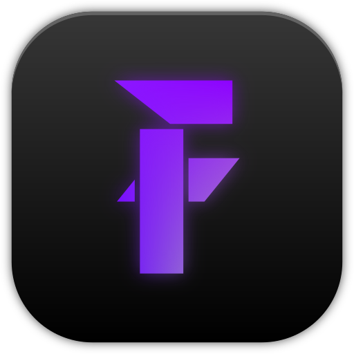

<!--
Credit for this README where credit's due:
- https://github.com/othneildrew/Best-README-Template/blob/main/README.md
- https://github.com/Louis3797/awesome-readme-template

These two templates have been extremely helpful when creating my own README template
and I've drawn inspiration from them heavily.

Please keep this acknowledgement in further modifications of the README file, though
it's not like I can tell you what to do. I'm just a comment in a text file.

Copyright 2025 (c) HyScript7
-->

<div align="center">
  <!-- Logo or Icon -->
  <a href="https://github.com/HyScript7/fvBot">
    
  </a>
  <h1>FvBot</h1>
  <!-- Badges -->
  <p>
    <a href="https://github.com/HyScript7/fvBot/blob/master/LICENSE">
      
    </a>
    <a href="https://github.com/HyScript7/fvBot/releases/">
      
    </a>
    <a href="https://github.com/HyScript7/fvBot/stargazers">
      
    </a>
  </p>
  <!-- Short Description -->
  <p>
  The discord bot that powers the official Fusionverse discord server.
  </p>
</div>

<details>
  <summary>📋 Table of Contents</summary>
  <ol>
    <li><a href="#about">🚀 About</a></li>
    <li>
      <a href="#getting-started">🏁 Getting Started</a>
      <ul>
        <li><a href="#prerequisites">✅ Prerequisites</a></li>
        <li><a href="#installing-dependencies">📦 Installing dependencies</a></li>
        <li><a href="#building">🏗️ Building</a></li>
        <li><a href="#testing">🧪 Testing</a></li>
        <li><a href="#running-for-development">🔧 Running for Development</a></li>
        <li><a href="#running-for-production">🚀 Running for Production</a></li>
      </ul>
    </li>
    <li><a href="#roadmap">🗺️ Roadmap</a></li>
    <li>
      <a href="#contributing">🤝 Contributing</a>
      <ul>
        <a href="#how-to-contribute">How to Contribute</a>
      </ul>
    </li>
    <li><a href="#support">✉️ Support</a></li>
    <li><a href="#license">📄 License</a></li>
    <li><a href="#acknowledgments">💖 Acknowledgments</a></li>
  </ol>
</details>

<a id="about"></a>

## 🚀 About

Fusionverse is a discord server I made for a fictional world I am building with
my friends. Since we want a very immersive experience, I designed and implemented
this discord bot in my favorite language - Java - in order to have a sort of
character creation process on first join, and other useful utilities I always
found lacking in the past.

<a id="built-with"></a>

## 🛠️ Built with

<div>
  <a href="https://www.java.com/en/">
    
  </a>
</div>
<div>
  <a href="https://gradle.org/">
    
  </a>
</div>
<div>
  <a href="https://spring.io/">
    
  </a>
</div>
<div>
  <a href="https://jda.wiki/">
    
  </a>
</div>

<a id="getting-started"></a>

## 🏁 Getting started

This section will walk you through setting up the project locally.
You can also consult the [Contributing Guide](./CONTRIBUTING.md) for more information.

<a id="prerequisites"></a>

### ✅ Prerequisites

Before you can setup the project, you need to have the following installed
and/or prepared:

- Java 21
- Gradle
- PostgreSQL Database (Optional)

  If you do not have a local PostgreSQL database, you can run a local instance
  using docker:

  ```sh
  docker run -d -p 5432:5432 -e POSTGRES_USER=fvbot -e POSTGRES_PASSWORD=fvbot postgres
  ```

- A discord bot token

  If you do not have a token, you can get one [here](https://discord.com/developers)

<a id="installing-dependencies"></a>

### 📦 Installing dependencies

After you clone the project using git or github cli
([concrete commands here](http://localhost:6419/CONTRIBUTING.md#development-environment-setup)),
you need to install the project dependencies using the appropriate package manager.

Since this is a gradle project, all you need to do is open it in your IDE
(which supports Gradle), or run `gradle` in the root directory of the repo.

<a id="building"></a>

### 🏗️ Building

To build the project, you can follow the steps below:

1. Make sure you are in the root of the repository directory
2. Run the command below

   ```sh
   docker build . -t fvBot:latest
   ```

Alternatively, if you do not want a docker image, you can run this command:

```sh
gradle bootjar
```

<a id="testing"></a>

### 🧪 Testing

To run unit tests, you can use the command below.

```sh
gradle boottest
```

<a id="running-for-development"></a>

### 🔧 Running for Development

To run the app without building, you can use the command below.

```sh
gradle bootrun
```

You may need to do a `gradle clean` first in some cases.

<a id="running-for-production"></a>

### 🚀 Running for Production

<!-- Bold of you to assume anything I wrote is production ready -->

Make sure you have the fvBot jar or docker image on the machine
you intend to use for hosting. Also make sure you have you bot token.
If you don't, you can get one [here](https://discord.com/developers).

You can specify a bot token by creating a `fvbot.properties` file and setting
the `fvbot.token` property to your token as such:

```properties
fvbot.token=your.token.here
```

This must be in the directory from which you are running the bot.

<a id="roadmap"></a>

## 🗺️ Roadmap

- [ ] 1.0.0 Release
  - [ ] Welcome
    - [ ] Character Creation
  - [ ] Title System
- [ ] 2.0.0 Release
  - [ ] Math
    - [ ] Eval
    - [ ] LaTeX
    - [ ] Dice
    - [ ] Probability / Chance
- [ ] 3.0.0 Release
  - [ ] Currency System
  - [ ] Item DB
    - [ ] Equipment
    - [ ] ~~Gambling~~ Method of obtaining items
    - [ ] Item Creator
      - [ ] Crafting
  - [ ] Character DB
  - [ ] Lore DB / Wiki

<a id="contributing"></a>

## 🤝 Contributing

Contributions are what make the open-source community such an amazing place to
learn, inspire, and create. Any contributions you make are **greatly appreciated**!

### How to contribute

1. Fork the project.
2. Create your feature branch:

   ```bash
   git checkout -b feature/amazing-feature
   ```

3. Commit your changes:

   ```bash
   git commit -m "Add some amazing feature"
   ```

4. Push to the branch:

   ```bash
   git push origin feature/amazing-feature
   ```

5. Open a pull request.

For more detailed guidelines, check out [CONTRIBUTING.md](CONTRIBUTING.md).

<a id="support"></a>

## ✉️ Support

If you encounter any issues or have questions, feel free to:

- Open an issue in the [Issues tab](https://github.com/HyScript7/fvBot/issues).
- Open a discussion in the [Discussions tab](https://github.com/HyScript7/fvBot/discussions).
- Reach out via email at **[hyscript7@gmail.com](mailto:hyscript7@gmail.com)**.
- Contact the repository maintainer on discord: @hyscript7

We're here to help!

<a id="license"></a>

## 📄 License

This project is licensed under the
**[BSD 3-Clause "New" or "Revised" License](LICENSE)** - feel free to use,
modify, and distribute this project in accordance with the license terms.

<a id="acknowledgments"></a>

## 💖 Acknowledgments

I would like to express my deepest gratitude to the following individuals and organizations:

- [JDA by dv8tion](https://github.com/discord-jda/JDA) - for the amazing discord
  API wrapper, which this project wouldn't be possible without.
- [Spring.io](https://spring.io/) - for making development easier.
- AngrytrashCZ, Spelis and all my other friends - for their invaluable advice
  and troubleshooting help.
